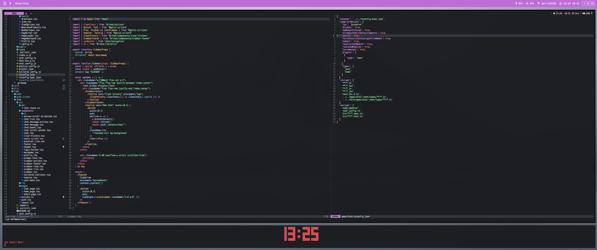

# Andykamp's.dotfiles

> This is my personal dofiles configuration which is used for web development with Typescript mainly.

## Aims
Super fast terminal based dev environment 

## Included
- **sketchybar** to visualilze currnt workspace and plugin
- **yabai** for seamles window management
- **fish** for shell
- **starship** as shell-prompt
- **alacritty** for terminal
- **neovim** for editing
- **tmux** for terminal multiplexing
- **tmux-session** script (custom) for seamless tmux session management
- **pomodoro-timer** script (custom) for pomodoro time management
- **vimium** for browser navigation
- chrome shortcuts like l3 --> localhost:3000 (OP!!)

## Inspiration
- [iaxhmedxi](https://github.com/ixahmedxi/nvim)
- [bautistaaa](https://github.com/bautistaaa/dootfiles/tree/master/nvim/lua/trash/plugins/configs)
- [trashvim](https://github.com/ixahmedxi/trashvim)
